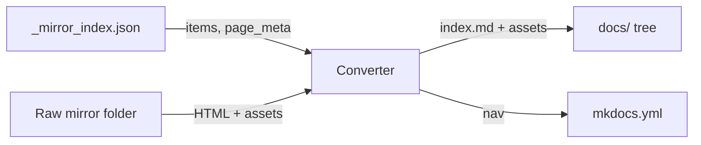
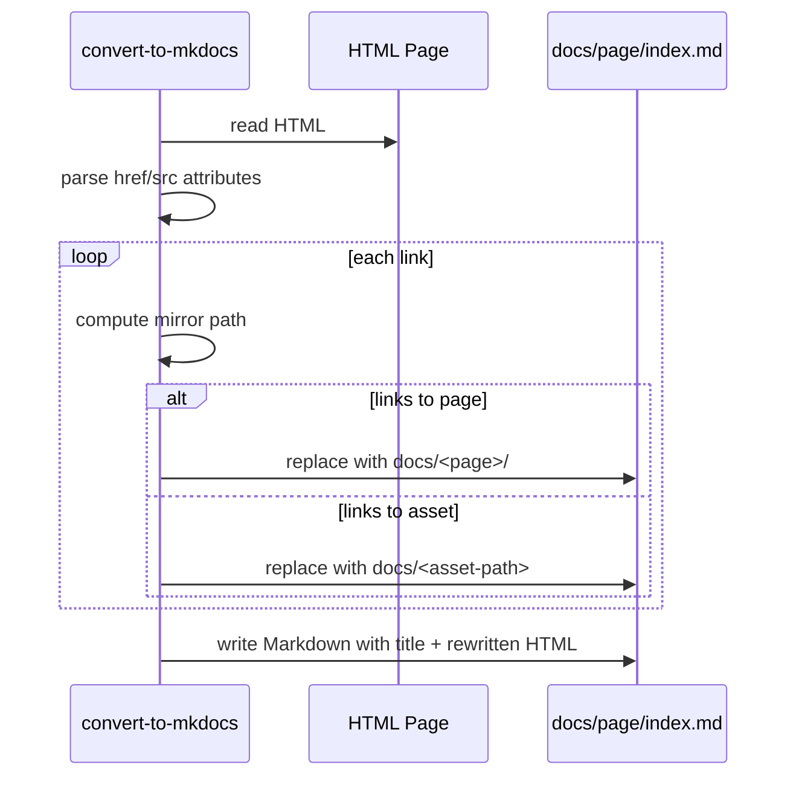

# Converter: Raw Mirror to MkDocs

This document describes the converter script at `sbin/convert-to-mkdocs`, which transforms a raw website mirror (produced by `sbin/mirror-site`) into a MkDocs-ready project.

## What it does

- **Scans the mirror**
  - Uses `_mirror_index.json` if present to identify pages and assets and to auto-detect the base URL.
  - Falls back to a filesystem scan when the index is not present.
- **Builds a MkDocs docs tree**
  - Creates a `docs/` directory (or a custom subdir) with one folder per source HTML page, each containing an `index.md`.
  - Copies assets (images, CSS/JS, fonts, media, etc.) into the same relative structure under `docs/`.
- **Rewrites links**
  - Converts `href`/`src` in pages to relative links pointing to MkDocs routes or to copied local assets.
- **Injects page titles**
  - Title priority: `page_meta.title` from the mirror index → HTML `<title>` tag → folder name fallback.
  - Inserts `# <Title>` at the top of each generated `index.md`.
- **Curates mkdocs.yml**
  - Generates a navigation grouped by top-level section (first path segment), using page titles.
  - Root-level pages appear at the top of the nav.

## Inputs and outputs

- **Input**: a raw mirror folder produced by `sbin/mirror-site`, containing HTML and assets. If available, `_mirror_index.json` is used to improve accuracy and metadata.
- **Output**: an MkDocs project folder (e.g., `INF100_H25_DOCS/`) containing:
  - `mkdocs.yml` with a curated nav (when `--write-config` is used)

## CLI

```
convert-to-mkdocs \
  --mirror-folder INF100_H25 \
  --output-folder INF100_H25_DOCS \
  [--docs-subdir docs] \
  [--base-url https://inf100.ii.uib.no/] \
  [--write-config] [--silent]
```

- **--mirror-folder** (required)
  - Path to the raw mirror folder (where `_mirror_index.json` and mirrored files live)
- **--output-folder** (required)
  - MkDocs project root where `docs/` and optionally `mkdocs.yml` are created
- **--docs-subdir**
  - Subdirectory under the output folder to place generated docs (default: `docs`)
- **--base-url**
  - Base site URL used to resolve absolute links; if omitted and `_mirror_index.json` exists, the converter uses `meta.base_url`
- **--write-config**
  - When set, writes (or overwrites) `mkdocs.yml` with a curated nav built from discovered pages and titles
- **--silent**
  - Suppresses progress logging

## How link rewriting works

- The converter parses `href` and `src` attributes in each HTML page.
- For on-site URLs (same domain as `--base-url` or absolute paths), it computes the corresponding local mirror path and then maps it to the `docs/` destination.
- Page links target the folder containing the page’s `index.md` (so MkDocs routes are directory-based).
- Asset links target the copied asset under `docs/`.
- External links remain unchanged.

## Title injection and metadata

- If the mirror index has `items[].page_meta.title` for a page, the converter uses it.
- Otherwise, it parses the page’s HTML `<title>` as a fallback.
- If neither is available, it uses the generated folder name or `Home`.

## Curated MkDocs nav

- The converter groups pages by the first path segment under `docs/`.
  - Example: `docs/notat/index.md` appears under a `notat:` section.
  - Root-level pages (like `docs/index.md`) are listed at the top.
- Entries are sorted by page title within each section.

## Examples

- Convert an existing mirror into a new MkDocs project:

```
convert-to-mkdocs \
  --mirror-folder INF100_H25 \
  --output-folder INF100_H25_DOCS \
  --write-config
```

- Convert and then serve with the helper:

```
convert-to-mkdocs \
  --mirror-folder INF100_H25 \
  --output-folder INF100_H25_DOCS \
  --write-config

uv run scripts/serve_mkdocs.py --project-root INF100_H25_DOCS --install-deps
```

## Notes & tips

- To regenerate titles or navigation after updating the mirror, simply re-run the converter with `--write-config`.
- The converter tries to keep link rewriting conservative and only adjusts exact attribute values. If you see missed links (e.g., generated by client-side JS), consider running `mirror_site.py --post-process` to normalize absolute links in the HTML prior to conversion.
- For very large mirrors, consider using `mirror_site.py --concurrency` to speed up asset downloads and `--include/--exclude` filters to limit scope.

## Conversion Flow



## Link Rewriting (Simplified)


