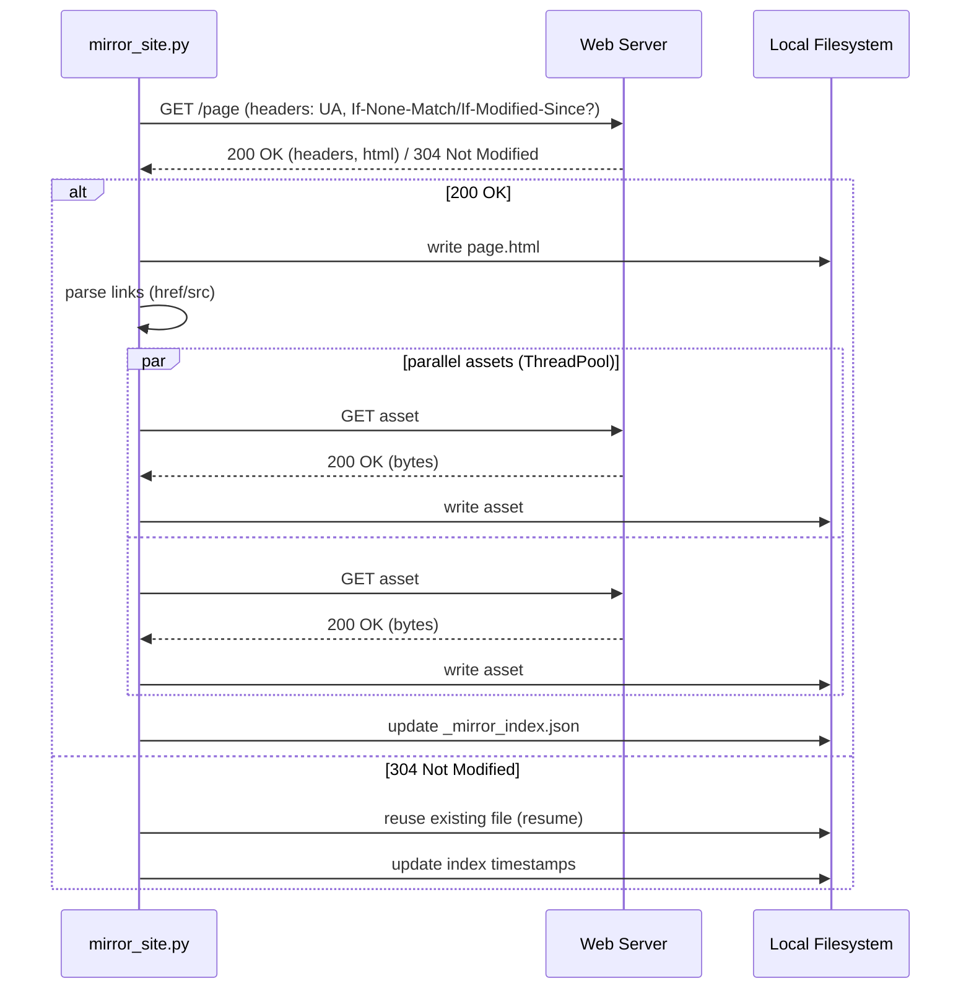

# Website Mirroring Toolkit

This repository contains a Python-based website mirroring script (`sbin/mirror-site`) that downloads a site to a local folder, rewrites links to local files, and generates a rich JSON/Markdown index capturing metadata, link graphs, and run context.

## Features

- **HTML and assets mirroring**: Saves HTML pages as `index.html` for directory-like URLs and stores assets (images, CSS/JS, fonts, media, documents) in the corresponding subfolders.
- **Link rewriting**: Rewrites `href`/`src` in HTML during the crawl to point to local files; optional post-processing normalizes any remaining same-domain absolute links to relative local paths.
- **Rich JSON index**: Emits `_mirror_index.json` with:
  - `meta`: run information, args, schema version
  - `items`: local filesystem inventory with per-file metadata
  - `urls`: per-URL metadata (headers, status, timestamps, local mapping, referers, depth)
  - `graph`: outbound and inbound link graph
  - `skipped_urls`, `errors`
- **Concurrency**: Parallel asset downloads using a thread pool (`--concurrency`).
- **Politeness**: Supports delay and basic `robots.txt` Disallow and Crawl-delay parsing.
- **Conditional GETs**: Uses `If-None-Match`/`If-Modified-Since` (unless `--re-download-all` is provided).

## Quick Start

### Prerequisites

- Python 3.9+
- [uv](https://github.com/astral-sh/uv) (recommended) or a Python virtualenv

Dependencies are managed via `pyproject.toml`. Optional dependency: `chardet` for better charset detection.

### Install

```
uv sync
```

### Basic Usage

```
mirror-site \
  --website-url https://example.com/ \
  --link-depth 2 \
  --target-folder MIRROR_FOLDER \
  --same-domain \
  --delay-seconds 0.5 \
  --post-process
```

### Common Flags

- `--website-url` (required): Root URL to mirror, e.g. `https://example.com/`
- `--target-folder` (required): Local folder for the mirror
- `--link-depth`: Max crawl depth (`0` = only start page)
- `--same-domain`: Restrict to same domain as `website-url`
- `--delay-seconds`: Politeness delay between requests
- `--timeout`: HTTP timeout in seconds
- `--user-agent`: Custom UA string
- `--post-process`: Normalize absolute same-domain links in all HTML to relative local paths after crawl
- `--re-download-all`: Force full re-download (bypasses conditional GETs)
- `--allow-all-asset-types`: Treat any non-HTML URL as an asset
- `--include`, `--exclude`: Path substring filters
- `--max-pages`: Limit number of HTML pages fetched
- `--concurrency`: Number of parallel asset downloads (default: 4)

## Notes & tips

- To regenerate titles or navigation after updating the mirror, simply re-run the converter with `--write-config`.
- The converter tries to keep link rewriting conservative and only adjusts exact attribute values. If you see missed links (e.g., generated by client-side JS), consider running `mirror_site.py --post-process` to normalize absolute links in the HTML prior to conversion.
- For very large mirrors, consider using `mirror_site.py --concurrency` to speed up asset downloads and `--include/--exclude` filters to limit scope.

## Crawl Pipeline (Overview)

```mermaid
flowchart TD
    A[Start URL] --> B{robots.txt}
    B -->|load & parse| C[Crawl policy (crawl-delay, disallow)]
    C --> D[Crawl queue (BFS by depth)]
    D --> E[Fetch page]
    E --> F[Extract links (href, src)]
    F --> G[Queue pages]
    F --> H[Download assets (parallel)]
    E --> I[Rewrite links in HTML]
    I --> J[Save page HTML]
    H --> K[Save assets]
    J --> L[Update index]
    K --> L
    L --> M[_mirror_index.json (meta, items, urls, graph)]
```

## Fetch / Asset Handling (Sequence)



### Index Outputs

After running, the target folder contains:

- `_mirror_index.json` — machine-readable index
- `_mirror_index.md` — human-readable summary
- `_mirror_index.log` — event log (newline-delimited JSON)

## JSON Index Schema (overview)

The JSON index is an object:

```
{
  "meta": {
    "base_url": str,
    "generated_at": ISO-8601 UTC,
    "target_root": str,
    "items_count": int,
    "tool": "mirror_site.py",
    "tool_version": "1",
    "schema_version": 1,
    "run_id": str?,
    "args": {
      "link_depth": int,
      "same_domain": bool,
      "delay_seconds": float,
      "timeout": int,
      "user_agent": str,
      "post_process": bool,
      "re_download_all": bool,
      "concurrency": int
    }
  },
  "items": [
    { "path": str, "type": "file"|"dir", "size": int, "mtime": ISO-8601, "mime": str?,
      "sha256": str?, "source_url": str?, "final_url": str?, "http_status": int?,
      "downloaded_at": ISO-8601?, "original_etag": str?, "original_last_modified": ISO-8601|str?,
      "original_content_type": str?, "original_content_length": int?,
      "target_abs_path": str, "target_root": str, "name": str, "ext": str, "kind": "page"|"asset"|"dir",
      "section": str, "page_meta": { ... }? },
    ...
  ],
  "urls": {
    "https://example.com/...": {
      "url": str, "final_url": str?, "http_status": int?, "headers": { ... },
      "downloaded_at": ISO-8601?, "local_path": str, "kind": "page"|"asset"|"unknown",
      "referers": [ str ], "depth": int?
    }, ...
  },
  "graph": { "out_edges": { url: [url, ...] }, "in_edges": { url: [url, ...] } },
  "skipped_urls": [ { "ts": ISO-8601, "url": str, "reason": str, "from": str } ],
  "errors": [ { "ts": ISO-8601, "url": str, "stage": str, "error": str } ]
}
```

Notes:

- `schema_version` is currently `1`. If you extend or change fields, bump this and document changes.
- `page_meta` for HTML may include: `title`, `meta_description`, `canonical_url`, `robots`, `hreflang`, `h1`, `h2`, `word_count`.

## Examples

Mirror depth 2 with post-process:

```
mirror-site \
  --website-url https://inf100.ii.uib.no \
  --target-folder INF100_H25 \
  --link-depth 2 --same-domain \
  --delay-seconds 0.5 --post-process
```

Force re-download all, with parallel assets:

```
mirror-site \
  --website-url https://inf100.ii.uib.no \
  --target-folder INF100_H25 \
  --link-depth 9999 --same-domain \
  --delay-seconds 0.2 --re-download-all \
  --concurrency 8
```

## Development

- Code: `sbin/mirror-site`
- Run help: `mirror-site --help`
- Lint errors during development will be surfaced by the IDE; address indentation and shared state writes when editing concurrent code.

### Design notes

- Asset downloads are parallelized; page fetching/rewriting is serialized to keep traversal deterministic.
- Conditional GETs are used to reduce bandwidth; `--re-download-all` disables conditional headers for a full refresh.
- A light `robots.txt` parser enforces Disallow and Crawl-delay where available.

## License

MIT (unless otherwise noted). If omitted, treat as internal use. Update this section to match your preferred license.

