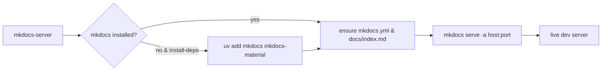

# MkDocs Server Helper

This document describes the helper script at `sbin/mkdocs-server`, which uses uv's inline dependencies feature (PEP 723) for self-contained execution. It's a robust wrapper for running a local MkDocs development server.

## Overview

`mkdocs-server` helps you:

- Ensure MkDocs is installed (optionally auto-install via `uv add`).
- Ensure a valid MkDocs project structure exists (create a minimal `mkdocs.yml` and `docs/index.md` if necessary).
- Start a local dev server with `mkdocs serve` on a specified host and port.

It is intended to work hand-in-hand with the converter at `sbin/convert-to-mkdocs` that builds a `docs/` tree from a raw mirror.

## Usage

```
mkdocs-server \
  --project-root PROJECT_DIR \
  [--docs-subdir docs] \
  [--host 127.0.0.1] \
  [--port 8000] \
  [--install-deps] \
  [--theme material] \
  [--silent]
```

- **--project-root** (required)
  - Path to an MkDocs project root (folder containing `mkdocs.yml`). If `mkdocs.yml` does not exist and `--install-deps` is provided, a minimal config will be generated.
- **--docs-subdir** (default: `docs`)
  - Subdirectory that contains the documentation sources.
- **--host** (default: `127.0.0.1`)
  - Host to bind the dev server to.
- **--port** (default: `8000`)
  - Port to bind the dev server to.
- **--install-deps**
  - If MkDocs is not installed, attempt to install `mkdocs` and `mkdocs-material` via `uv add`.
- **--theme** (default: `material`)
  - Theme to use when generating a minimal `mkdocs.yml`.
- **--silent**
  - Reduce console output.

## What it creates or ensures

- If MkDocs is missing and `--install-deps` is passed:
  - Runs `uv add mkdocs mkdocs-material` to install dependencies into the project environment.
- If `mkdocs.yml` is missing:
  - Writes a minimal configuration:
    ```yaml
    site_name: Mirrored Site
    docs_dir: docs
    theme:
      name: material
    nav:
      - Home: index.md
    ```
- If `docs/index.md` is missing:
  - Creates a placeholder page with a simple heading.

## Example flows

- **Serve a converted mirror** (after running `sbin/convert-to-mkdocs`):
  ```
  mkdocs-server --project-root MKDOCS_PROJECT --install-deps
  ```
  Then open `http://127.0.0.1:8000` in your browser.

- **Serve a generic MkDocs project with custom host/port**:
  ```
  mkdocs-server \
    --project-root my_mkdocs_project \
    --host 0.0.0.0 \
    --port 8080 \
    --install-deps
  ```

## Troubleshooting

- If the command reports `mkdocs` not found:
  - Re-run with `--install-deps` to automatically install `mkdocs` and `mkdocs-material` via `uv`.
- If you see a 404 for a page you expect:
  - Ensure the page exists under the `docs/` directory and is referenced in `mkdocs.yml` (your nav). If you used the converter, re-run it with `--write-config` to regenerate the nav.
- If the server won’t bind to the port:
  - The port may be in use. Try a different `--port` (e.g., `--port 8001`).

## Related scripts

- `sbin/mirror-site` — Mirrors a website to a local folder and writes `_mirror_index.json`.
- `sbin/convert-to-mkdocs` — Converts the raw mirror to a MkDocs-ready project with curated navigation.

## Notes

- This helper uses your current project’s environment via `uv`. If you prefer a global environment, install `mkdocs` system-wide and run `mkdocs serve` directly in the project root.

## Orchestration Diagram


